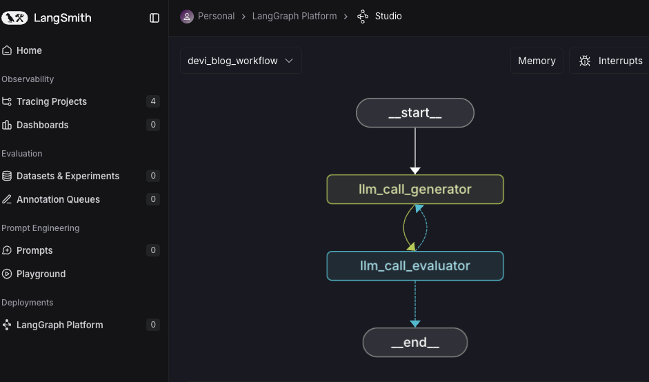
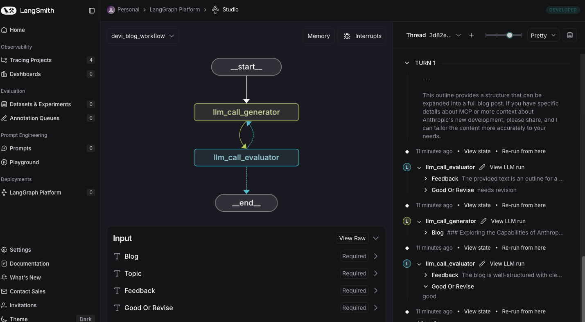
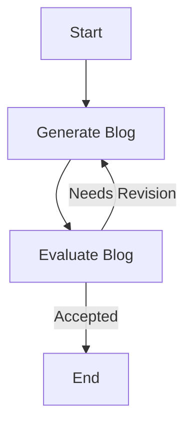
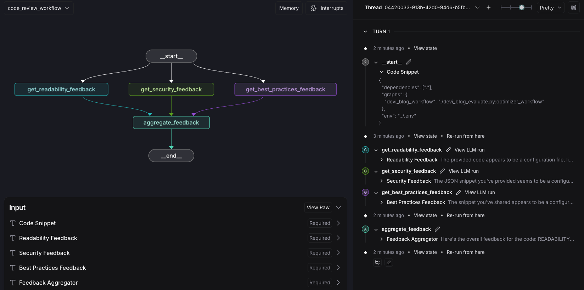
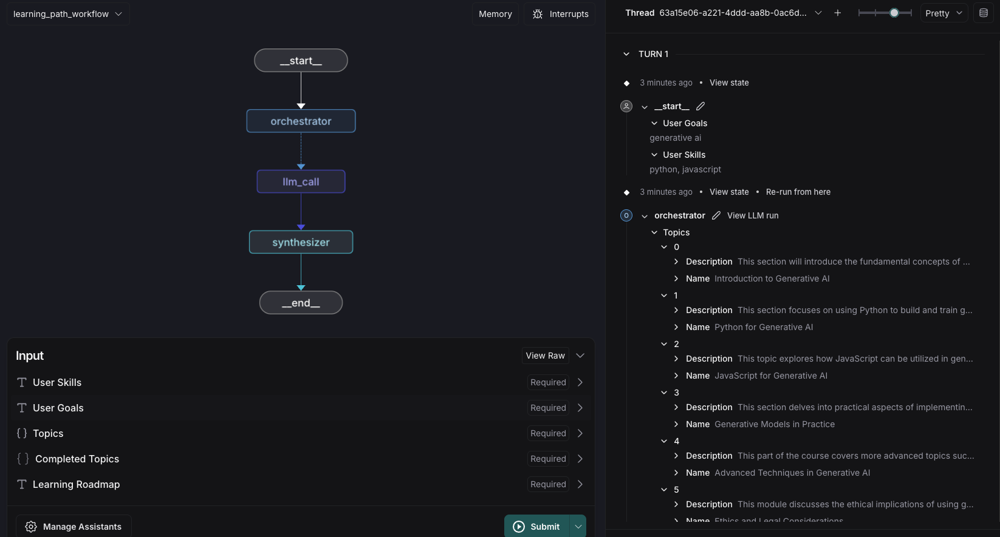
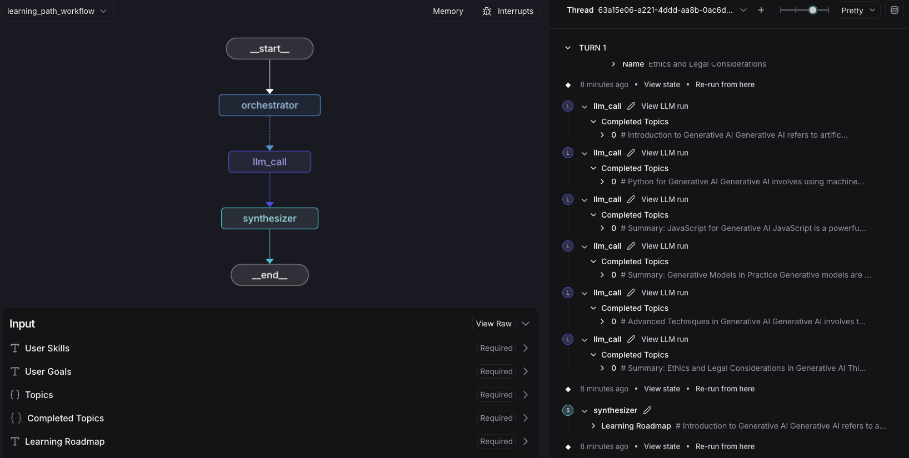

# Blog Evaluator




# Blog Generation Workflow

## Overview
This project implements an **Evaluator-Optimizer Workflow** using **LangGraph** and **LangChain** to generate and refine short blogs. The workflow follows an iterative process where an LLM generates a blog, evaluates it against predefined criteria, and either accepts it or provides feedback for revision. This ensures that the final output meets quality standards.

## Why This Workflow Works
The **Evaluator-Optimizer Workflow** is effective because it automates content generation while maintaining **quality control** through an LLM-powered evaluation loop. If the initial blog meets the set criteria (**concise, engaging, structured with subtitles and a conclusion**), it is accepted. Otherwise, the LLM provides feedback, and the blog is regenerated with improvements.

## Features
- **Automated Blog Generation**: Generates a blog based on a given topic.
- **Evaluation & Feedback**: Reviews the blog for conciseness, structure, and entertainment value.
- **Iterative Refinement**: If the blog needs revision, feedback is provided, and a revised version is generated.
- **LangSmith Studio Integration**: Visualizes and tests workflow execution.

## Workflow Overview

- **Generates** an initial blog based on the provided topic.
- **Evaluates** the blog and determines if it meets quality standards.
- **Routing Decision**:
  - If the blog is **good**, the workflow **ends**.
  - If the blog **needs revision**, feedback is given, and a new version is generated.

## Setup & Usage

### Install dependencies:
```bash
pip install langchain_groq langgraph pydantic python-dotenv
```

### Set environment variables in a `.env` file:
```env
GROQ_API_KEY=your_api_key
LANGCHAIN_API_KEY=your_langchain_api_key
```

### Run the script in an IDE or Jupyter Notebook:
```python
state = optimizer_workflow.invoke({"topic": "MCP from Anthropic"})
print(state["blog"])
```

## Testing in LangSmith Studio
- Deploy the workflow and **provide only the topic** as input.
- Monitor execution flow and **validate outputs** by logging into your LangSmith account (Adding @traceable to your function helps track it)
- You can also test via Langraph dev (ensure you have the langgraph.json file for this)


# Parallelized Code Review with LLMs


## Introduction
This project demonstrates a **parallelized workflow** for **automated code review** using **large language models (LLMs)**. Instead of running feedback checks sequentially, the system executes multiple review processes **in parallel**, making it an **efficient and scalable** solution for code assessment.

### Why Parallelization?
- **Faster Execution:** Multiple feedback checks run **simultaneously**, reducing the overall processing time.
- **Improved Scalability:** New review criteria can be added without significant slowdowns.
- **Better Resource Utilization:** Leverages LLM calls efficiently by distributing tasks.

## Features
- **Readability Analysis**: Evaluates the clarity and structure of the code.
- **Security Review**: Identifies potential vulnerabilities.
- **Best Practices Compliance**: Checks adherence to industry-standard coding best practices.
- **Feedback Aggregation**: Combines results into a single, structured response.

## How It Works
1. A **code snippet** is provided as input.
2. Three independent LLM processes analyze the snippet for:
   - Readability
   - Security vulnerabilities
   - Best practices adherence
3. The results from these processes are aggregated into a final feedback report.

## Technologies Used
- **Python**
- **LangChain** (LLM-based workflow automation)
- **LangGraph** (Parallel execution of LLM tasks)
- **Groq API** (LLM inference)
- **Pydantic & TypedDict** (Data validation)
- **Dotenv & OS** (Environment variable management)

## Running the Code
1. Clone this repository:
  
2. Install dependencies:
   ```sh
   pip install -r requirements.txt
   ```
3. Set up your environment variables in .env file

4. Run the script
 

## Testing in LangSmith Studio
- Deploy the workflow and **provide only the topic** as input.
- Monitor execution flow and **validate outputs** by logging into your LangSmith account (Adding @traceable to your function helps track it)
- You can also test via Langraph dev (ensure you have the langgraph.json file for this)


# Learning Path Generator



## Overview
This project implements an **Orchestrator-Synthesizer** workflow to dynamically generate a personalized **learning roadmap** based on a user's existing skills and learning goals. It uses **LangChain, LangGraph, and Groq AI models** to generate structured study plans and topic summaries.

## Why Orchestrator-Synthesizer?
The **Orchestrator-Synthesizer** pattern is ideal for structured content generation workflows where tasks need to be dynamically assigned, processed independently, and then combined into a final output. It differs from traditional parallelization in the following ways:
- **Orchestration** dynamically determines what needs to be processed, ensuring relevant tasks are executed based on user input.
- **Workers** independently generate content summaries for each topic in the study plan.
- **Synthesis** intelligently merges topic summaries into a well-structured learning roadmap.

This ensures a **scalable, modular, and adaptable** approach to content generation, avoiding unnecessary processing while keeping results contextual.

## Workflow Breakdown
The workflow consists of three key components:

### 1️⃣ Orchestrator
- Creates a **study plan** based on the user's **skills and learning goals**.
- Uses an LLM with a structured output schema to generate a list of **learning topics**.

### 2️⃣ Workers
- Each **worker** processes an individual **learning topic**.
- Generates a **markdown-formatted content summary** for the topic, including key concepts and learning resources.

### 3️⃣ Synthesizer
- Collects all **topic summaries** and organizes them into a **cohesive learning roadmap**.
- Ensures smooth flow and structured representation of the learning journey.

## Code Structure
- `orchestrator(state: State)`: Generates the study plan dynamically.
- `llm_call(state: WorkerState)`: Summarizes a single topic.
- `synthesizer(state: State)`: Merges all topic summaries into the final roadmap.
- `assign_workers(state: State)`: Dynamically assigns tasks based on generated topics.

## Running the Workflow
To generate a personalized learning path, the workflow takes the following inputs:

```python
user_skills = "Python programming, basic machine learning concepts"
user_goals = "Learn advanced AI, master prompt engineering, and build AI applications"
```

It then executes the **Orchestrator → Workers → Synthesizer** pipeline, producing a structured learning roadmap.

## Future Enhancements
- **Incorporate user feedback loops** to refine study plans over time.
- **Add multimodal learning resources** (e.g., videos, interactive exercises).
- **Expand to different learning domains** beyond AI and machine learning.
---


